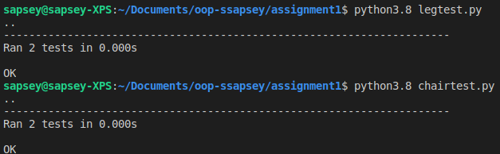

# Assignment 1

## Made a leg and chair class in Python. The leg class has a maximum weight it can hold before it will break, and the chair class has a method called sit(). If the weight that gets passed into sit exceeds the maximum weight of the chair, one of the legs wil break. The chair class also has attributes like the number of legs, the material that it's made out of, and the length of the legs.  

## Run

```bash
    python3.8 main.py
```

## Test
```bash
    python3.8 legtest.py
    python3.8 chairtest.py
```


## Test Screenshot: 