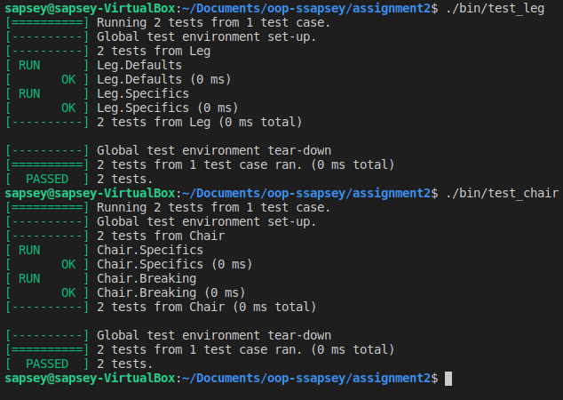

# Assignment 2

## Converted Assignment 1 into a C++ project. Uses the Google Test Framework for testing. 

## Build
```bash
    make clean
    make all
```

## Test
```bash
    ./bin/test_leg
    ./bin/test_chair
```

## Test Screenshot: 