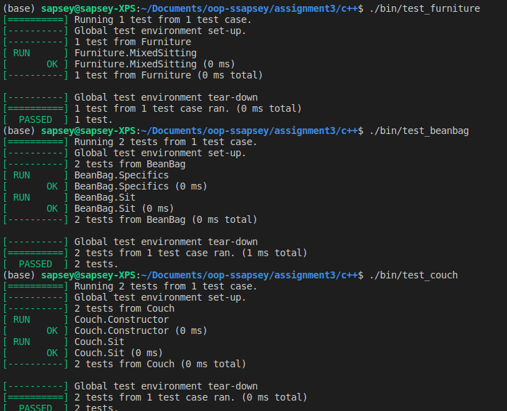
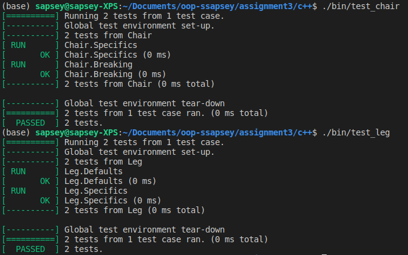

# C++ Polymorphic Assigment

## Build
```bash
make clean
make all
```

## Test
```bash
./bin/test_furniture
./bin/test_beanbag
./bin/test_couch
./bin/test_leg
./bin/test_chair
```

## Test Screenshot #1: 

## Test Screenshot #2: 