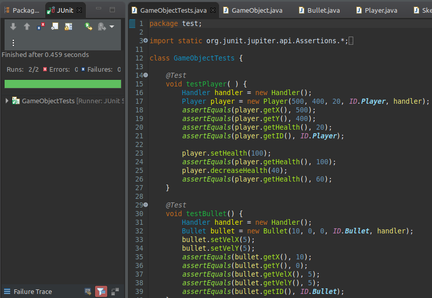

# OOP Final Project
## Created a simple top down game, where the player character has to shoot randomly spawning enemies to survive. There are two different enemy types that get dynamically created at run time, which utilizes the factory design pattern.

## Slides
https://docs.google.com/presentation/d/1VeAwM1XD6Mq5XtMfw6R6a3y2ylVv1rIA5dQAXz5JJ2c/edit?usp=sharing

## Video Recording
https://youtu.be/41Zo8vlbbk4

## Test Screenshot:
