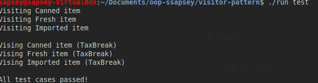

# Visitor Design Pattern

## Created an example of the Visitor Design Pattern. There are 3 objects: Canned Goods Fresh Goods, and Imported Goods, that all need to be taxed differently. The Visitor handles the different tax amounts without the need to change the structure of the objects. 

## Build
```bash
./build
```
## Run main
```bash
./run
```

## Test
```bash
./run test
```

## Clean
```bash
./build clean
```

## Test Screenshot: 
